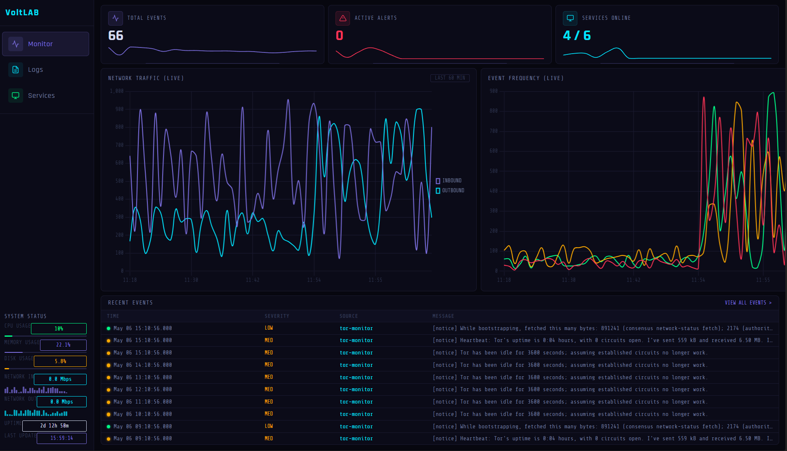

# Home SOC Lab

> **Running 24/7 on an Asus TUF A15 — 16GB RAM, 1TB SSD, Ubuntu Server 24.04 LTS**

---

Starting with a spare laptop and Ubuntu Server, the goal was simple — understand what actually happens inside a Security Operations Center by building one. A SIEM to collect logs, an IDS to watch network traffic, a custom dashboard to visualize it all in real time. What started as a weekend experiment grew into a full detection and response environment running on bare metal, 24/7. Every component reflects something a SOC analyst does on the job — and hands-on assembly of it taught more than any course could.

---

## What This Demonstrates

A working SOC environment built and operated end-to-end log ingestion, network traffic analysis, real-time threat detection, incident investigation, and response. Every layer of the stack was configured manually(using vibe coding), including the SIEM pipeline, IDS ruleset, firewall policy, VPN server, and a custom monitoring dashboard built from scratch. The lab runs continuously and generates real alerts from real traffic.

---

**SIEM · IDS/IPS · Log Analysis · Network Monitoring · Incident Response · Linux · Python · Splunk SPL · Threat Detection · Self-Hosted Infrastructure**

---

## Stack

| Component | Tool | Purpose |
|---|---|---|
| SIEM | Splunk Free 10.2.1 | Log ingestion, SPL correlation, alerting |
| Network IDS | Suricata | Packet inspection, ~65K Emerging Threats rules |
| SOC Dashboard | Flask + psutil + Chart.js | Live service monitoring, log viewer |
| Cloud Storage | Nextcloud 33 | Self-hosted file storage on Apache2 |
| Evasion Sim | Tor + Proxychains4 | Anonymized traffic — detection target |
| VPN | WireGuard | Self-hosted VPN server |
| Remote Access | Tailscale | Zero-trust VPN mesh |
| Firewall | UFW | Port and access management |
| OS | Ubuntu Server 24.04 LTS | Headless, SSH-only host |

---

## Project Structure

### [voltlab-dashboard](./voltlab-dashboard/)
A custom-built SOC dashboard for real-time server monitoring, live log streaming, and service management. Built from scratch rather than configuring a pre-built tool — which required understanding what data matters and how to surface it for fast triage.

---

### [nextcloud-gallery](./nextcloud-gallery/)
Self-hosted cloud storage and photo management running on Apache2, MariaDB, and PHP — with a custom Flask gallery interface on top.
- Mirrors the on-premise and hybrid cloud environments common in enterprise environments
- Managing the full stack — web server, database, application layer, and access controls — is directly applicable to infrastructure security roles

---

### [threat-detection](./threat-detection/)
Suricata IDS monitoring live network traffic, feeding alerts into Splunk via eve.json. Includes a full SPL query library mapped to real attack techniques.
- Writing detection logic in SPL replicates what analysts do daily in enterprise SIEMs
- The Suricata → Splunk pipeline mirrors production SOC log ingestion workflows

---

### [vpn-tor-lab](./vpn-tor-lab/)
A WireGuard VPN server for secure remote access, paired with a Tor + Proxychains4 evasion simulation environment used as a live detection target.
- Tor generates real anonymized traffic that Suricata and Splunk are tuned to catch — not simulated, actual evasion traffic running on the network
- Demonstrates both sides: how attackers obscure traffic and how defenders detect it

---

### [docs](./docs/)
Network architecture diagrams and incident reports documenting real detections from the lab.

---

Ronit · Windsor, ON · [github.com/ronitlxd](https://github.com/ronitlxd)
