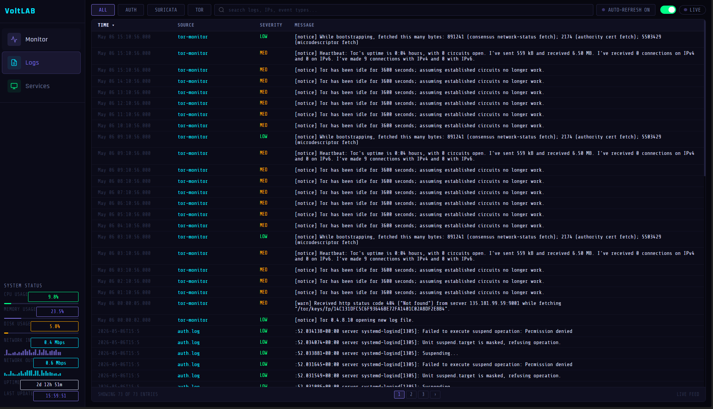
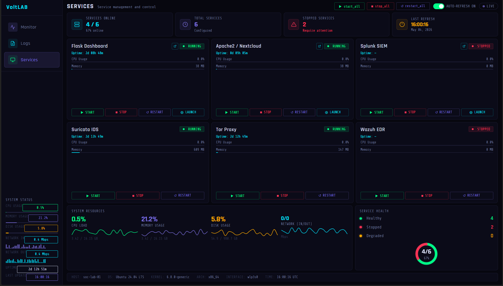

# VoltLAB — SOC Dashboard

> **Custom Flask dashboard for live server monitoring, log streaming, and service control**

---

Pre-built monitoring tools hide what they're actually doing. They surface a number, not the path the data took to get there. VoltLAB was built from the ground up to remove that abstraction — pulling raw metrics straight from the kernel through psutil, pushing them into Chart.js in real time, and exposing systemd controls through a single web UI. Building it meant deciding what mattered, where to look for it, and how to surface it fast enough to act on. The result is a dashboard that doubles as a working knowledge of how a SOC monitoring stack actually fits together.

---

## Screenshots



---

## Features

**Monitor**
- Stat cards for total events, active alerts, services online, threats detected
- Live CPU, RAM, and network throughput charts driven by psutil
- Recent Events table with severity badges

**Logs**
- Real-time log streaming from system and service sources
- Deduplication to cut repeat noise
- API traffic filter to isolate dashboard-internal calls

**Services**
- Start, stop, and restart controls for every lab service
- One-click launch buttons for Splunk and Nextcloud

---

## Stack

| Component | Tool |
|---|---|
| Web framework | Flask (Python 3) |
| System metrics | psutil |
| Live charts | Chart.js |
| Process control | systemd via subprocess |
| Theme | `#0f0e17` background · `#7c6fe0` accent |

---

## Deployment

```bash
sudo pip3 install flask psutil --break-system-packages
sudo cp -r . /opt/soc-dashboard/
sudo systemctl enable --now homelab-dashboard
```

Runs at `http://<server-ip>:5000`. Service unit at `/etc/systemd/system/homelab-dashboard.service`.

---

## Port

| Port | Service |
|---|---|
| 5000 | VoltLAB Dashboard |
